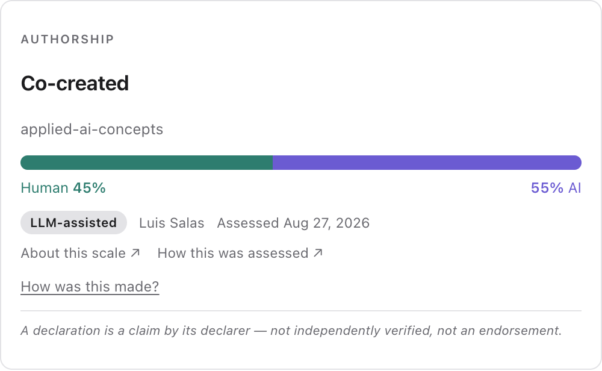

<p align="center">
  
</p>

<h1 align="center">applied-ai-concepts</h1>

---

## What is this?

This repository is an [AI literacy](concepts/ai-literacy.md) resource that explains the concepts behind designing, using, and governing AI systems. It is written for practitioners, governance teams, and anyone responsible for AI-related decisions and outcomes in their organization.

### Why it matters

Most organizations are deploying AI systems faster than they can understand and govern them. The language for talking clearly about how these systems work, where they fail, and who is accountable is scattered across research papers, vendor blogs, and regulation. This wiki gathers that language in one place, in plain terms — so an engineer, a product manager, and a compliance lead can use the same words for the same ideas, and make better decisions because of it.

### How it works

This wiki is continuously refined over time. New source materials are integrated into existing entries instead of simply added on top. Definitions evolve, links between concepts become clearer, and conflicting perspectives are identified and documented rather than ignored.

**Every entry declares what kind of term it is**, in a line directly under its title: whether it is an established term of art, one still `emerging` with definitions that vary between sources, one this wiki has `named itself`, or one coined by a single vendor. The field invents vocabulary faster than it settles it, and a reference that repeats every new label without comment is a list of buzzwords. This is a separate judgment from each entry's confidence level — that rates the *evidence*; this rates the *term*. Both are stated, because they vary independently. Every tracked term and its status is public in the [term register](glossary/register.md) — including the ones not published, and the ones that will not be. See [CONTRIBUTING](CONTRIBUTING.md#term-status--the-admission-test) for the test itself.

Content is AI-assisted and human-reviewed, and this wiki declares exactly how — stage by stage, from who had the idea to who verified the sources — in a published [authorship declaration](https://luispsalas.github.io/authorship-meter/declarations/applied-ai-concepts.html). Each published entry is validated and supported by maintained source references.

### Data governance perspective

This wiki treats AI and data governance as closely connected. Alongside technical explanations, entries also highlight accountability, auditability, risk, observability, and control considerations relevant to real-world organizations.

→ [Governance & Observability Notes](notes/governance-and-observability.md)

### Looking a concept up

Browse the [glossary index](glossary/index.md) — 95 terms alphabetically with their one-line essences — or use **`search.html`**, a self-contained search page covering every term plus 509 hand-written synonyms.

It is built for concept lookup rather than text search, so describing the problem works: *"who is responsible when the AI does it"*, *"it used to work"*, *"why do I get different answers"*. Each result shows which synonym matched.

**→ [Search the wiki](https://luispsalas.github.io/applied-ai-concepts/search.html)**

The page is self-contained, so cloning the repo and opening `search.html` works identically offline. The same data is published as [`search-index.json`](search-index.json) for tooling and AI retrieval.

### Using the glossary in projects

The glossary can also be downloaded as a context package for AI and governance-related projects. It can help support governance-aware implementations, best practices, observability initiatives, and shared terminology across teams.

→ See the [Using this as context](#using-this-as-context) section for setup instructions.

---

## Start here

New here? Every entry explains one concept in layers — a **plain-language version** for decision-makers, a **technical definition** for practitioners, and **governance notes** on accountability and risk — so the same page works whether you build AI systems or answer for them.

**A short path through the foundations:**

1. [Large Language Models (LLMs)](concepts/large-language-models.md) — what the models underneath everything actually are
2. [Determinism vs Probabilism](concepts/determinism-vs-probabilism.md) — why they don't give the same answer twice, and why that matters
3. [Hallucination](concepts/hallucination.md) → [Grounding](concepts/grounding.md) — how they fail, and the main way to keep them honest
4. [Harness Paradigm](concepts/harness-paradigm.md) — why control lives around the model, not inside it
5. [AI Governance](concepts/ai-governance.md) — who decides how a system behaves, and who is answerable when it doesn't

**Or browse everything:** the [glossary](glossary/index.md) lists all published terms with one-line definitions.

---

## Design philosophy

>  **Persistent synthesis over retrieval.**  
> New sources are synthesized into existing entries, not appended. The wiki is the output; source documents are inputs. Inspired by Karpathy's LLM Wiki model — *stop re-deriving, start compiling.*

>  **Context as leverage.**  
> The quality of any AI interaction is bounded by the quality of context it receives. Understanding *why* changes how you design systems, not just how you prompt them.

>  **Governance lives in the design.**  
> Every entry surfaces the control, accountability, and oversight implications of a concept — AI literacy without governance awareness is incomplete.

>  **Explicit over implicit.**  
> Assumptions, confidence levels, and knowledge gaps are surfaced in every entry. Uncertainty is documented, not hidden.

---

## How are entries written?

Each concept is explained through several complementary "lenses" within a single entry, so readers can understand both the idea itself and its practical implications.

- **One-line essence:** A short, memorable explanation of the concept designed for quick understanding and easy reference.

- **Technical definition:** A more precise explanation of how the concept works, using accurate terminology and clarifying differences between related concepts.

- **Plain-language version:** The same idea explained in simpler, non-technical language for business teams, decision-makers, and non-engineering audiences.

- **AI literacy notes:** Practical guidance on why the concept matters in real organizations. It includes common misunderstandings, workflow impacts, and what teams should pay attention to when adopting AI.

- **Governance notes:** The accountability, oversight, risk, and control considerations connected to the concept. Entries highlight key governance questions, common failure modes, recommended practices, and the organizational roles typically responsible for oversight.

---

## How sources are handled

Every claim in this wiki is meant to trace back to a real, checkable source — not "general consensus" or an unlinked paraphrase. Each entry's Sources table cites a specific paper, standard, or article with a stable ID (`SRC-###`) tracked in a maintained registry; vendor-authored sources are flagged as such rather than presented as neutral authority; and where no adequate source exists yet, the gap is marked openly with `⚠️ Source needed` instead of papered over.

→ See [CONTRIBUTING.md](CONTRIBUTING.md) for the full sourcing standard.

---

## Concepts

### Foundations
*How models behave — and why that behavior matters*

| Concept | One-line essence | Status |
|---|---|---|
| [Large Language Models (LLMs)](concepts/large-language-models.md) | Neural networks trained on vast text corpora that generate language by predicting what comes next — the foundation of most modern AI tools and agents | ✅ v1.0 |
| [Small Language Models (SLMs)](concepts/small-language-models.md) | Language models small enough to run cheaply, locally, or at the edge — often the better fit for narrow, repetitive tasks | ✅ v1.0 |
| [Local LLMs](concepts/local-llms.md) | Models run on your own infrastructure — the data stays in, and every duty the provider was carrying becomes yours | ✅ v1.0 |
| [Determinism vs Probabilism](concepts/determinism-vs-probabilism.md) | Why AI models generate statistically likely outputs rather than fixed answers — the same input can produce different results | ✅ v1.0 |
| [Reasoning Models / Test-Time Compute](concepts/reasoning-models.md) | Models that spend extra computation "thinking" through a problem step by step before answering — trading speed for higher accuracy on hard tasks | ✅ v1.0 |
| [Multimodal AI](concepts/multimodal-ai.md) | Text, images, audio and video in one system — every text risk carried across, with weaker tooling to detect it | ✅ v1.0 |
| [Sycophancy (LLMs)](concepts/sycophancy-llms.md) | Models agreeing with users rather than being accurate — a behavior the training signal rewards, not an incidental bug | ✅ v1.0 |
| [Confidence vs Accuracy](concepts/confidence-vs-accuracy.md) | How sure a model sounds is not evidence of how right it is — tone is generated independently of correctness | ✅ v1.0 |
| [Knowledge Cutoff](concepts/knowledge-cutoff.md) | Every model was trained up to a fixed date and knows nothing after it — and cannot reliably tell you when a question falls outside what it knows | ✅ v1.0 |
| [Hallucination](concepts/hallucination.md) | AI models generate plausible-sounding content that is factually incorrect — confidently and without warning | ✅ v1.2 |
| [Black Box](concepts/black-box.md) | An AI system whose internal reasoning process cannot be observed or interpreted — even when its outputs can | ✅ v1.1 |
| [Bias (AI Systems)](concepts/bias-ai-systems.md) | Systematic errors that unfairly advantage or disadvantage certain groups — often inherited from training data, rarely visible in any single output | ✅ v1.0 |
| [Explainability (XAI)](concepts/explainability-xai.md) | Describing, in terms a human can understand, why an AI system produced a specific output — a prerequisite for accountability | ✅ v1.0 |
| [Types of AI Systems](concepts/types-of-ai-systems.md) | A taxonomy of AI by capability and autonomy — from narrow task tools to general-purpose models — that determines governance, risk, and oversight | ✅ v1.1 |
| [Fine-tuning](concepts/fine-tuning.md) | Adapting a model on your own data — cheap enough to be routine, and it can silently strip the safety behavior you were relying on | ✅ v1.0 |
| [RLHF (Reinforcement Learning from Human Feedback)](concepts/rlhf.md) | Humans rank outputs, the model learns the ranking — the step that turns a raw model into an assistant, and imports whoever did the ranking | ✅ v1.0 |
| [Pre-training](concepts/pre-training.md) | The first and largest training stage, where a model learns language and world knowledge from a huge corpus — the stage that fixes what it knows and that nobody can undo afterwards | ✅ v1.0 |
| [Temperature (LLMs)](concepts/temperature-llms.md) | The sampling knob that tunes how varied a model's output is — widely believed to be an accuracy control, and measurably not one | ✅ v1.0 |
| [Tokenization](concepts/tokenization.md) | How text is chopped into the units a model actually processes — the same units you are billed for, and the reason cost and context differ by language | ✅ v1.0 |

### Interaction & Design
*How you work with models effectively*

| Concept | One-line essence | Status |
|---|---|---|
| [Context Engineering](concepts/context-engineering.md) | Designing what an AI model receives is as important as the model itself | ✅ v1.1 |
| [Prompt Engineering](concepts/prompt-engineering.md) | Structuring inputs to consistently elicit useful, accurate, and safe model outputs | ✅ v1.1 |
| [Anthropomorphism (AI)](concepts/anthropomorphism-ai.md) | Reading fluent language as understanding, intent or care — the reflex underneath most other misconceptions about AI | ✅ v1.0 |
| [Human–LLM Communication Skills](concepts/human-llm-communication-skills.md) | Working well with a model is mostly noticing what you left unstated — and knowing when not to trust the answer | ✅ v1.0 |
| [Curse of Knowledge (AI Context)](concepts/curse-of-knowledge-ai-context.md) | You cannot un-know what you know, so you under-specify — and the model answers anyway instead of asking | ✅ v1.0 |
| [Cognitive Offloading & Deskilling](concepts/cognitive-offloading-deskilling.md) | Delegating thinking to a system erodes the skill needed to judge its output — the long-run cost of convenience | ✅ v1.0 |
| [Performativity (LLMs)](concepts/performativity-llms.md) | Language models do not just describe language, they change it — measurably shifting the words people use, with the influence running back from the machine into human culture | ✅ v1.0 |

### System Architecture
*The control layer that makes models governable*

| Concept | One-line essence | Status |
|---|---|---|
| [Harness Paradigm](concepts/harness-paradigm.md) | Intelligence and control are separate layers — governance lives in the harness | ✅ v1.3 |
| [AI Agent](concepts/ai-agent.md) | A language model that doesn't just respond — it plans, acts, and iterates across multiple steps | ✅ v1.2 |
| [Tool Use](concepts/tool-use.md) | How an AI model acts on the world rather than just describing it — calling external functions, APIs, and data sources | ✅ v1.0 |
| [Multi-Agent Systems](concepts/multi-agent-systems.md) | Multiple AI agents with different roles working together on a task — coordination and division of labor instead of one model doing everything | ✅ v1.0 |
| [Orchestration (AI Systems)](concepts/orchestration-ai-systems.md) | The control layer deciding what runs and in what order — where the failures hide in the seams and look like success | ✅ v1.0 |
| [Retrieval-Augmented Generation (RAG)](concepts/rag.md) | A technique that grounds model outputs in retrieved, verifiable information | ✅ v1.2 |
| [Guardrails (AI Systems)](concepts/guardrails-ai-systems.md) | Technical and policy constraints that prevent an AI system from producing outputs or taking actions outside defined boundaries | ✅ v1.0 |
| [System Prompt](concepts/system-prompt.md) | The behind-the-scenes instructions that set how an AI behaves before you interact with it — a soft control, not a hard boundary | ✅ v1.0 |
| [Prompt Injection](concepts/prompt-injection.md) | A trick where malicious instructions hidden in text the AI reads hijack its behavior — the top-ranked LLM application security risk | ✅ v1.0 |
| [Jailbreak](concepts/jailbreak.md) | Bypassing a model's safety training through crafted prompts rather than a technical flaw — getting it to do what it was trained to refuse | ✅ v1.0 |
| [Embeddings](concepts/embeddings.md) | Turning text into coordinates so that similar meanings sit close together — the representation that makes semantic search work, and that carries the training data's biases as geometry | ✅ v1.0 |

### Knowledge & Memory
*How knowledge persists, degrades, and stays fit for use*

| Concept | One-line essence | Status |
|---|---|---|
| [Persistent Synthesis](concepts/persistent-synthesis.md) | Knowledge compounds when contradictions are resolved, not accumulated | ✅ v1.2 |
| [Data Quality](concepts/data-quality.md) | The fitness of data for its intended use — and the upstream constraint on every AI system built on it | ✅ v1.0 |
| [Data Provenance / Lineage](concepts/data-provenance-lineage.md) | Where the data came from and what has happened to it since — the record that answers "can we actually use this?" | ✅ v1.1 |
| [Training Data](concepts/training-data.md) | What the model learned from — where its knowledge, gaps, blind spots and biases all come from, and which is rarely disclosed | ✅ v1.0 |
| [Copyright & AI Output](concepts/copyright-ai-output.md) | Who owns what a model makes, and whether training was lawful — two questions, one with a US answer and one genuinely open | ✅ v1.0 |
| [Grounding](concepts/grounding.md) | Anchoring model outputs to specific, verifiable sources — reducing hallucination by giving the model something real to reason from | ✅ v1.0 |
| [Knowledge Base](concepts/knowledge-base.md) | The collection of documents an AI can look up when answering — the quality of the library determines the quality of the answers | ✅ v1.0 |
| [Memory (AI Systems)](concepts/memory-ai-systems.md) | How an AI remembers — what it keeps in a conversation, what carries over to future sessions, and what it reuses as learned skill | ✅ v1.0 |
| [Domain](concepts/domain.md) | The specific field the AI is working in — what counts as a "good" or "wrong" answer depends entirely on the domain | ✅ v1.0 |
| [Context Window](concepts/context-window.md) | The maximum amount of text an AI model can consider at once — a hard limit on what it can reason about | ✅ v1.0 |
| [Context (AI Systems)](concepts/context-ai-systems.md) | Everything the model receives before it answers — one bounded, undifferentiated stream, assembled fresh every time | ✅ v1.0 |

### Human Oversight
*Humans in control by design — not by assumption*

| Concept | One-line essence | Status |
|---|---|---|
| [Human-in-the-Loop (HITL)](concepts/human-in-the-loop.md) | A design pattern that keeps humans as decision authorities at critical points | ✅ v1.1 |
| [Human Responsibility in AI Use](concepts/human-responsibility-in-ai-use.md) | The obligation to oversee AI decisions does not transfer to the system — it remains with the humans who deploy and use it | ✅ v1.1 |
| [Permission Model (AI)](concepts/permission-model-ai.md) | What an AI may do on its own, what needs human approval, and what is always off-limits — enforced, not requested | ✅ v1.0 |
| [Agency (AI Systems)](concepts/agency-ai-systems.md) | How much a system may do without asking — granted by an organization, not possessed by the model | ✅ v1.0 |
| [Human–AI Collaboration Model](concepts/human-ai-collaboration-model.md) | The explicit design of how people and AI systems divide work, hand over, and resolve disagreement — documented, not assumed | ✅ v1.0 |
| [Automation Bias](concepts/automation-bias.md) | People stop checking a system that is usually right — which is how a rare wrong answer becomes a bad decision | ✅ v1.0 |
| [RACI](concepts/raci.md) | Who does the work, who answers for it, who is consulted, who is informed — the system can be Responsible, only a person can be Accountable | ✅ v1.1 |
| [Scalable Oversight](concepts/scalable-oversight.md) | Using AI to supervise AI because the work has outrun direct human review — and the unresolved question of who checks the checker | ✅ v1.0 |
| [Moral Crumple Zone](concepts/moral-crumple-zone.md) | The human operator who absorbs blame when an automated system fails — protecting the system's integrity at the nearest person's expense, exactly as a car's crumple zone absorbs a crash | ✅ v1.0 |

### Reliability & Quality
*Measuring and maintaining what AI systems actually do*

| Concept | One-line essence | Status |
|---|---|---|
| [Evaluation (AI Systems)](concepts/evaluation.md) | The structured practice of measuring whether an AI system does what it is supposed to do — before deployment and continuously in production | ✅ v1.1 |
| [Failure Modes (AI Systems)](concepts/failure-modes-ai-systems.md) | The specific ways an AI system can go wrong — each requiring a different detection-and-response control | ✅ v1.0 |
| [Red Teaming](concepts/red-teaming.md) | Deliberately attacking your own AI system — probing for jailbreaks, data leaks, and harmful outputs before anyone else finds them | ✅ v1.0 |
| [Deception (AI Systems)](concepts/deception-ai-systems.md) | Output that systematically induces false beliefs because something other than truth was being optimized for | ✅ v1.1 |
| [Concealing Uncertainty](concepts/concealing-uncertainty.md) | A tentative answer presented as settled — the caveats a calibrated response would surface, trained away | ✅ v1.0 |
| [Synthetic Media (Deepfakes)](concepts/synthetic-media-deepfakes.md) | Generation scales and verification does not — and the documented harm is fraud and intimate imagery, not mainly politics | ✅ v1.0 |
| [Reward Hacking (Specification Gaming)](concepts/reward-hacking.md) | The system satisfies the metric and defeats the point — and more capable models do it more, not less | ✅ v1.0 |
| [Power Seeking](concepts/power-seeking.md) | Capability is useful for almost any goal, so optimization drifts toward more access and more room to operate — no motive required | ✅ v1.0 |
| [Alignment (AI Systems)](concepts/alignment-ai-systems.md) | Making a system's behavior match what was actually intended — and the prior question of whose intentions those are | ✅ v1.0 |
| [Verification](concepts/verification.md) | Checking this output against ground truth before trusting it — and the finding that people check least on the problems that most need it | ✅ v1.0 |
| [Model/Data Drift](concepts/model-data-drift.md) | The quiet decay of a deployed system as the world moves away from its training data — nothing breaks, accuracy just slides | ✅ v1.0 |
| [Model Version & Update](concepts/model-version-update.md) | The system you use today may not be the one you tested — providers change models underneath you, and reliable behavior can shift without notice | ✅ v1.0 |

### Observability & Governance
*Making AI system behavior visible and accountable*

| Concept | One-line essence | Status |
|---|---|---|
| [Observability (AI Systems)](concepts/observability.md) | The ability to understand what an AI system is doing — and reconstruct why — from the outside | ✅ v1.0 |
| [AI Governance](concepts/ai-governance.md) | The frameworks, policies, and accountability structures that determine who decides how AI systems behave — and who is answerable when they don't | ✅ v1.1 |
| [Ownership (AI Systems)](concepts/ownership-ai-systems.md) | Explicit assignment of accountability for an AI system's outputs, data, and governance — defining who is responsible, not just who built it | ✅ v1.0 |
| [Accountability (AI Systems)](concepts/accountability-ai-systems.md) | The principle that someone can be held answerable for an AI system's behavior — and that answerable means explain, justify, and face consequences | ✅ v1.0 |
| [Audit Trail (AI)](concepts/audit-trail-ai.md) | The structured record of what an AI system received, decided, and did — enabling accountability and governance review after the fact | ✅ v1.0 |
| [Compliance (AI Systems)](concepts/compliance-ai-systems.md) | Meeting defined AI obligations — and being answerable for whether they were actually met, not just documented | ✅ v1.0 |
| [Data Minimization](concepts/data-minimization.md) | Collecting and keeping only the data a system actually needs — less data, less risk, lower cost | ✅ v1.0 |
| [Privacy (AI Systems)](concepts/privacy-ai-systems.md) | The rights and obligations that govern how personal data is used in AI training and deployment — and the responsibility to uphold them | ✅ v1.0 |
| [Data Leakage (AI Systems)](concepts/data-leakage-ai-systems.md) | When sensitive information from training data or context surfaces in model outputs — exposing what was never meant to be accessible | ✅ v1.0 |
| [AI Incident (Reporting)](concepts/ai-incident-reporting.md) | A documented event where an AI system caused or nearly caused harm — now with legal deadlines to report it, not just fix it quietly | ✅ v1.0 |
| [AI Management System (ISO 42001)](concepts/ai-management-system-iso-42001.md) | The certifiable standard for governing AI across its lifecycle — it certifies the process, not the product | ✅ v1.0 |
| [Shadow AI](concepts/shadow-ai.md) | Unsanctioned AI use — invisible to the processes meant to govern it, and usually a signal about the sanctioned option | ✅ v1.0 |
| [Model Card / System Card](concepts/model-card-system-card.md) | The transparency artifact — a scoping document whose job is to say where *not* to use a model | ✅ v1.0 |
| [Content Provenance & Watermarking (C2PA)](concepts/content-provenance-watermarking.md) | Signed labels and invisible marks on generated content — a positive detection means something, a negative one does not | ✅ v1.0 |
| [AI Disclosure (Attribution)](concepts/ai-disclosure-attribution.md) | Saying AI was used — a human practice, distinct from machine marking, and only one of them satisfies the law | ✅ v1.0 |
| [Bluewashing](concepts/bluewashing.md) | Responsible-AI claims with nothing behind them — the test is whether anything can constrain a decision | ✅ v1.0 |
| [Fundamental Rights Impact Assessment (FRIA)](concepts/fundamental-rights-impact-assessment.md) | A deployer's pre-launch assessment of who is affected and what recourse they have — and it binds far fewer organizations than commonly claimed | ✅ v1.0 |
| [Systemic Risk (AI)](concepts/systemic-risk-ai.md) | A precise legal threshold for a few model providers — and an unregulated concentration risk carried by everyone else | ✅ v1.0 |
| [Frontier AI (Frontier Model)](concepts/frontier-ai.md) | The leading edge — a category defined by capabilities being discovered after training, not by size | ✅ v1.0 |

### Organizational Readiness
*The human and organizational conditions for responsible AI adoption*

| Concept | One-line essence | Status |
|---|---|---|
| [AI Literacy](concepts/ai-literacy.md) | The competencies required to engage with, use, and govern AI systems responsibly — at an individual, team, and organizational level | ✅ v1.1 |
| [AI Use Case](concepts/ai-use-case.md) | A defined, bounded application of AI to a specific problem — the unit of design, risk assessment, and governance accountability | ✅ v1.0 |
| [Operational Readiness (AI)](concepts/operational-readiness-ai.md) | Whether the organization can actually run an AI system — data, infrastructure, skills, process, governance — not whether the model works | ✅ v1.0 |
| [Scalability (AI Systems)](concepts/scalability-ai-systems.md) | Volume scales, review capacity does not — and nothing alarms when a governed tool becomes an unreviewed pipeline | ✅ v1.0 |
| [Value Realization (AI)](concepts/value-realization-ai.md) | The gap between what AI can do and what an organization gets from it — closed by complementary investment, not by better models | ✅ v1.0 |
| [Continuous Feedback & Improvement](concepts/continuous-feedback-improvement.md) | Treating an AI system as something that must be watched and corrected for as long as it runs — a standing capability with an owner, not a post-launch intention | ✅ v1.0 |
| [Tacit Knowledge](concepts/tacit-knowledge.md) | The expertise people have but cannot fully put into words — the hardest thing to give an AI system as context, and the first thing lost when people stop practicing | ✅ v1.0 |

---

## Governance & Observability Notes

Practical notes on what to control, monitor, and be accountable for — organized by theme across the core concepts.

| Note | Covers |
|---|---|
| [Governance & Observability](notes/governance-and-observability.md) | Verification · Context governance · System control · Accountability checklist |

---

## Using this as context

<p align="center">
  
</p>

The concepts in this wiki are designed to be used as structured context within AI projects, not just read as reference material. Each entry is self-contained, consistently structured, and written to support both human understanding and machine processing.

**Clone or download**
```bash
git clone https://github.com/luispsalas/applied-ai-concepts.git
```
Or download as a ZIP from the repository's main page (Code → Download ZIP).

- **Obsidian** — Copy the `/concepts/` and `/glossary/` directories into your Obsidian vault. Entries use standard markdown and will render as-is. Internal links resolve within the vault. Useful as a reference layer alongside your own project notes.

- **LogSeq** — Import the `/concepts/` directory into a LogSeq graph. Entries are flat markdown files with no proprietary syntax — they will load without modification.

- **Claude Projects** — Upload individual concept files or the full `/concepts/` directory as project knowledge. The model will use the shared vocabulary and governance framing as context across your conversations.

- **ChatGPT (custom GPTs)** — Add concept files as knowledge sources when configuring a custom GPT. The `glossary/index.md` file is particularly useful as a lightweight single-file attachment for non-technical audiences.

- **Cursor / Windsurf / AI-assisted editors** — Add the `/concepts/` directory to your project workspace. These editors will index the files and make them available as context when generating or reviewing code that involves AI system design decisions.

- **RAG pipelines (LangChain, LlamaIndex, etc.)** — The `/concepts/` directory works as a document collection out of the box. Each file is a discrete, well-structured chunk — no pre-processing required before embedding.

---

## Can I suggest a term or a correction?

Yes — and that includes disagreeing with what's already here. If a concept is missing, an entry is wrong or out of date, or you have a real source that could close a `⚠️ Source needed` flag, open a GitHub Issue with one of these labels:

- **`new-term`** — a concept that belongs here isn't covered yet
- **`correction`** — an error, a broken link, or a citation that has gone stale
- **`source`** — a source that supports or replaces a flagged gap
- **`discussion`** — a question about scope, framing, or accuracy

Nothing is merged automatically. Every change is reviewed by a human before it lands, and every new claim needs a source like any other.

→ [CONTRIBUTING.md](CONTRIBUTING.md) explains what to include in each kind of issue.

---

## Versioning

Each entry carries a version number and last-updated date. The repository follows a simple model:

- `v1.x` — initial publication and refinements
- `v2.x` — cross-reference layer and additional concepts
- `v3.x` — audience rendering and glossary automation

See [CHANGELOG.md](CHANGELOG.md) for version history.

---

## Status

**Phase 1 ✅ — foundation:** core concepts published and sourced, each with a governance-notes section; standalone [governance & observability notes](notes/governance-and-observability.md) doc live.
**Phase 2 (current) — breadth & cross-linking:** 95 concepts across 8 categories, a [glossary index](glossary/index.md), client-side [search](search.html), and a cross-reference layer connecting related entries.
**Phase 3 (planned):** audience-specific rendering, glossary automation, and a manifesto distilled from the wiki's principles.

---

## Authorship

This wiki is made by a human working with AI models, and it says so in the same structured way it asks of any other AI-assisted work. The declaration below breaks the contribution down across five stages — conception, structure, production, curation, verification — rather than reducing it to a single "AI-generated" label.

<a href="https://luispsalas.github.io/authorship-meter/declarations/applied-ai-concepts.html">
  
</a>

→ **[View the interactive declaration](https://luispsalas.github.io/authorship-meter/declarations/applied-ai-concepts.html)** — assessed with the [Authorship Meter](https://github.com/luispsalas/authorship-meter) format.

It covers the wiki as a whole at the release version named in the declaration, not any single entry — individual entries carry their own version line — and is re-assessed at each minor release.
