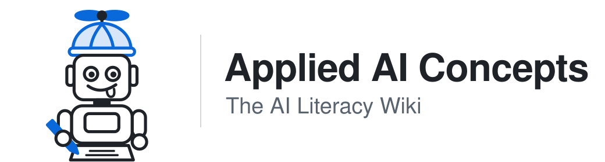

<p align="center">
  <picture>
    <source media="(prefers-color-scheme: dark)" srcset="assets/banner-dark.svg">
    
  </picture>
</p>

Technical and plain-language explanations of how AI systems work, how they fail, and who answers for them, for the people who build, buy and oversee them. **Every entry is sourced, and every entry ends with governance notes.**

| Look it up | Put it to work |
|---|---|
| **[Glossary →](glossary/index.md)**<br>153 terms, A–Z, each with a one-line definition. | **[Use as project context →](#use-it-as-project-context)**<br>Load the wiki into Claude, ChatGPT, Cursor or a RAG pipeline. |
| **[Search →](https://luispsalas.github.io/applied-ai-concepts/search.html)**<br>Describe the problem in plain words. Matches 1009 synonyms. | **[Governance & Observability Notes →](notes/governance-and-observability.md)**<br>What to control, monitor and answer for across the core concepts. |

---

## Start here

Five entries that explain the foundations, in order:

1. [Large Language Models (LLMs)](concepts/large-language-models.md): what the models underneath everything actually are
2. [Determinism vs Probabilism](concepts/determinism-vs-probabilism.md): why they don't give the same answer twice, and why that matters
3. [Hallucination](concepts/hallucination.md) → [Grounding](concepts/grounding.md): how they fail, and the main way to keep them honest
4. [Harness Paradigm](concepts/harness-paradigm.md): why control lives around the model, not inside it
5. [AI Governance](concepts/ai-governance.md): who decides how a system behaves, and who is answerable when it doesn't

---

## Governance & Observability Notes

Understanding a concept is not enough: you also need to know what to control, what to monitor, and who is accountable. Every entry ends with governance notes, and this companion reference brings them together across four themes: **verification**, **context governance**, **system control**, and an **accountability checklist**.

→ **[Read the Governance & Observability Notes](notes/governance-and-observability.md)**

---

## Concepts

The terms other entries rely on most, in each category. Browse [every term A–Z](glossary/index.md), or the [term register](glossary/register.md), which also lists terms considered and not published, and why.

<!-- key-terms:start (generated by scripts/build.py write; edit glossary/categories.md, not this block) -->

| Category | Key terms | Browse |
|---|---|---|
| **Foundations**<br>*How models behave — and why that behavior matters* | [Large Language Models (LLMs)](concepts/large-language-models.md) · [Hallucination](concepts/hallucination.md) · [Bias (AI Systems)](concepts/bias-ai-systems.md) · [Confidence vs Accuracy](concepts/confidence-vs-accuracy.md) | [All&nbsp;31&nbsp;→](glossary/categories.md#foundations) |
| **Interaction & Design**<br>*How you work with models effectively* | [Context Engineering](concepts/context-engineering.md) · [Prompt Engineering](concepts/prompt-engineering.md) · [Anthropomorphism (AI)](concepts/anthropomorphism-ai.md) · [Cognitive Offloading & Deskilling](concepts/cognitive-offloading-deskilling.md) | [All&nbsp;9&nbsp;→](glossary/categories.md#interaction--design) |
| **System Architecture**<br>*The control layer that makes models governable* | [Guardrails (AI Systems)](concepts/guardrails-ai-systems.md) · [Harness Paradigm](concepts/harness-paradigm.md) · [AI Agent](concepts/ai-agent.md) · [Retrieval-Augmented Generation (RAG)](concepts/rag.md) | [All&nbsp;21&nbsp;→](glossary/categories.md#system-architecture) |
| **Knowledge & Memory**<br>*How knowledge persists, degrades, and stays fit for use* | [Data Provenance / Lineage](concepts/data-provenance-lineage.md) · [Training Data](concepts/training-data.md) · [Data Quality](concepts/data-quality.md) · [Grounding](concepts/grounding.md) | [All&nbsp;20&nbsp;→](glossary/categories.md#knowledge--memory) |
| **Human Oversight**<br>*Humans in control by design — not by assumption* | [Human-in-the-Loop (HITL)](concepts/human-in-the-loop.md) · [Permission Model (AI)](concepts/permission-model-ai.md) · [Human Responsibility in AI Use](concepts/human-responsibility-in-ai-use.md) · [Automation Bias](concepts/automation-bias.md) | [All&nbsp;10&nbsp;→](glossary/categories.md#human-oversight) |
| **Reliability & Quality**<br>*Measuring and maintaining what AI systems actually do* | [Evaluation (AI Systems)](concepts/evaluation.md) · [Model Version & Update](concepts/model-version-update.md) · [Failure Modes (AI Systems)](concepts/failure-modes-ai-systems.md) · [Verification](concepts/verification.md) | [All&nbsp;22&nbsp;→](glossary/categories.md#reliability--quality) |
| **Observability & Governance**<br>*Making AI system behavior visible and accountable* | [Audit Trail (AI)](concepts/audit-trail-ai.md) · [Compliance (AI Systems)](concepts/compliance-ai-systems.md) · [Observability (AI Systems)](concepts/observability.md) · [AI Governance](concepts/ai-governance.md) | [All&nbsp;32&nbsp;→](glossary/categories.md#observability--governance) |
| **Organizational Readiness**<br>*The human and organizational conditions for responsible AI adoption* | [AI Literacy](concepts/ai-literacy.md) · [Operational Readiness (AI)](concepts/operational-readiness-ai.md) · [AI Use Case](concepts/ai-use-case.md) · [Scalability (AI Systems)](concepts/scalability-ai-systems.md) | [All&nbsp;8&nbsp;→](glossary/categories.md#organizational-readiness) |

<!-- key-terms:end -->

---

## Use it as project context

Every entry is a self-contained Markdown file with the same structure, so the wiki works as context for AI tools as well as reading material.

```bash
git clone https://github.com/luispsalas/applied-ai-concepts.git
```

| Tool | How to use it |
|---|---|
| **Claude Projects** | Upload `/concepts/`, or individual entries, as project knowledge. |
| **ChatGPT custom GPTs** | Add entries as knowledge. `glossary/index.md` works as a light single-file option. |
| **Cursor, Windsurf and other AI editors** | Add `/concepts/` to the workspace. |
| **RAG pipelines** (LangChain, LlamaIndex…) | Use `/concepts/` as the document collection; each file is one clean chunk. |
| **Obsidian, LogSeq** | Copy `/concepts/` and `/glossary/` into a vault or graph; links resolve as-is. |

The search data is also published as [`search-index.json`](search-index.json) for tooling.

---

## How this wiki works

**Term status.** Every entry says what kind of term it is: an established term of art, an emerging one, a label this wiki coined, or one coined by a single vendor. That is judged separately from how strong the evidence is. → [Term register](glossary/register.md) · [The admission test](CONTRIBUTING.md#term-status--the-admission-test)

**Sources.** Every claim traces to a checkable source with a registered ID. Vendor material is flagged, and a gap is marked `⚠️ Source needed` rather than papered over. → [Sourcing standard](CONTRIBUTING.md)

**Entry structure.** One-line essence · technical definition · plain-language version · AI literacy notes · governance notes · confidence level · sources.

**Design principles.** [Persistent synthesis](concepts/persistent-synthesis.md) over retrieval: new sources are merged into existing entries, and conflicts are resolved or documented. [Context as leverage](concepts/context-engineering.md): what a model is given bounds what it can do. [Governance lives in the design](concepts/harness-paradigm.md): control belongs in the system around the model. Explicit over implicit: confidence and gaps are stated, not hidden.

---

## Contribute

Missing a concept, spotted an error, or have a source that closes a `⚠️ Source needed` gap? Open an issue labeled `new-term`, `correction`, `source` or `discussion`. Disagreement is welcome. Every change is reviewed by a person, and every new claim needs a source. → [CONTRIBUTING.md](CONTRIBUTING.md)

---

## Authorship

Made by a human working with AI models, and declared stage by stage (conception, structure, production, curation, verification) rather than with a single "AI-generated" label.

<a href="https://luispsalas.github.io/authorship-meter/declarations/applied-ai-concepts.html">
  
</a>

→ **[View the interactive declaration](https://luispsalas.github.io/authorship-meter/declarations/applied-ai-concepts.html)**, assessed with the [Authorship Meter](https://github.com/luispsalas/authorship-meter) format and re-assessed at each minor release.

---

**Status:** Phase 2 — 153 concepts across 8 categories, cross-linked, with a glossary and search. Each entry carries its own version; history is in the [CHANGELOG](CHANGELOG.md). Planned next: audience-specific rendering and a manifesto.
