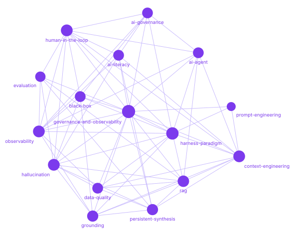

<p align="center">
  
</p>

<h1 align="center">applied-ai-concepts</h1>

---

## What is this?

This repository is an [AI literacy](concepts/ai-literacy.md) resource that explains the concepts behind designing, using, and governing AI systems. It is written for practitioners, governance teams, and anyone responsible for AI-related decisions and outcomes in their organization.

### Why it matters

Most people now rely on AI systems they don't fully understand, and most organizations are deploying them faster than they can govern them. The language for talking clearly about how these systems work, where they fail, and who is accountable is scattered across research papers, vendor blogs, and regulation. This wiki gathers that language in one place, in plain terms — so an engineer, a product manager, and a compliance lead can use the same words for the same ideas, and make better decisions because of it.

### How it works

This wiki is continuously refined over time. New source materials are integrated into existing entries instead of simply added on top. Definitions evolve, links between concepts become clearer, and conflicting perspectives are identified and documented rather than ignored.

Content is AI-assisted and periodically human-reviewed. Each published entry is validated and supported by maintained source references.

### Data governance perspective

This wiki treats AI and data governance as closely connected. Alongside technical explanations, entries also highlight accountability, auditability, risk, observability, and control considerations relevant to real-world organizations.

→ [Governance & Observability Notes](notes/governance-and-observability.md)

### Using the glossary in projects

The glossary can also be downloaded as a context package for AI and governance-related projects. It can help support governance-aware implementations, best practices, observability initiatives, and shared terminology across teams.

→ See the [Using this as context](#using-this-as-context) section for setup instructions.

---

## Start here

New here? Every entry explains one concept in layers — a **plain-language version** for decision-makers, a **technical definition** for practitioners, and **governance notes** on accountability and risk — so the same page works whether you build AI systems or answer for them.

**A short path through the foundations:**

1. [Large Language Models (LLMs)](concepts/large-language-models.md) — what the models underneath everything actually are
2. [Determinism vs Probabilism](concepts/determinism-vs-probabilism.md) — why they don't give the same answer twice, and why that matters
3. [Hallucination](concepts/hallucination.md) → [Grounding](concepts/grounding.md) — how they fail, and the main way to keep them honest
4. [Harness Paradigm](concepts/harness-paradigm.md) — why control lives around the model, not inside it
5. [AI Governance](concepts/ai-governance.md) — who decides how a system behaves, and who is answerable when it doesn't

**Or browse everything:** the [glossary](glossary/index.md) lists all published terms with one-line definitions.

---

## Design philosophy

>  **Persistent synthesis over retrieval.**  
> New sources are synthesized into existing entries, not appended. The wiki is the output; source documents are inputs. Inspired by Karpathy's LLM Wiki model — *stop re-deriving, start compiling.*

>  **Context as leverage.**  
> The quality of any AI interaction is bounded by the quality of context it receives. Understanding *why* changes how you design systems, not just how you prompt them.

>  **Governance lives in the design.**  
> Every entry surfaces the control, accountability, and oversight implications of a concept — AI literacy without governance awareness is incomplete.

>  **Explicit over implicit.**  
> Assumptions, confidence levels, and knowledge gaps are surfaced in every entry. Uncertainty is documented, not hidden.

---

## How are entries written?

Each concept is explained through several complementary "lenses" within a single entry, so readers can understand both the idea itself and its practical implications.

- **One-line essence:** A short, memorable explanation of the concept designed for quick understanding and easy reference.

- **Technical definition:** A more precise explanation of how the concept works, using accurate terminology and clarifying differences between related concepts.

- **Plain-language version:** The same idea explained in simpler, non-technical language for business teams, decision-makers, and non-engineering audiences.

- **AI literacy notes:** Practical guidance on why the concept matters in real organizations. It includes common misunderstandings, workflow impacts, and what teams should pay attention to when adopting AI.

- **Governance notes:** The accountability, oversight, risk, and control considerations connected to the concept. Entries highlight key governance questions, common failure modes, recommended practices, and the organizational roles typically responsible for oversight.

---

## How sources are handled

Every claim in this wiki is meant to trace back to a real, checkable source — not "general consensus" or an unlinked paraphrase. Each entry's Sources table cites a specific paper, standard, or article with a stable ID (`SRC-###`) tracked in a maintained registry; vendor-authored sources are flagged as such rather than presented as neutral authority; and where no adequate source exists yet, the gap is marked openly with `⚠️ Source needed` instead of papered over.

→ See [CONTRIBUTING.md](CONTRIBUTING.md) for the full sourcing standard.

---

## Concepts

### Foundations
*How models behave — and why that behavior matters*

| Concept | One-line essence | Status |
|---|---|---|
| [Large Language Models (LLMs)](concepts/large-language-models.md) | Neural networks trained on vast text corpora that generate language by predicting what comes next — the foundation of most modern AI tools and agents | ✅ v1.0 |
| [Determinism vs Probabilism](concepts/determinism-vs-probabilism.md) | Why AI models generate statistically likely outputs rather than fixed answers — the same input can produce different results | ✅ v1.0 |
| [Hallucination](concepts/hallucination.md) | AI models generate plausible-sounding content that is factually incorrect — confidently and without warning | ✅ v1.1 |
| [Black Box](concepts/black-box.md) | An AI system whose internal reasoning process cannot be observed or interpreted — even when its outputs can | ✅ v1.0 |
| [Bias (AI Systems)](concepts/bias-ai-systems.md) | Systematic errors that unfairly advantage or disadvantage certain groups — often inherited from training data, rarely visible in any single output | ✅ v1.0 |
| [Explainability (XAI)](concepts/explainability-xai.md) | Describing, in terms a human can understand, why an AI system produced a specific output — a prerequisite for accountability | ✅ v1.0 |
| [Types of AI Systems](concepts/types-of-ai-systems.md) | A taxonomy of AI by capability and autonomy — from narrow task tools to general-purpose models — that determines governance, risk, and oversight | ✅ v1.1 |

### Interaction & Design
*How you work with models effectively*

| Concept | One-line essence | Status |
|---|---|---|
| [Context Engineering](concepts/context-engineering.md) | Designing what an AI model receives is as important as the model itself | ✅ v1.1 |
| [Prompt Engineering](concepts/prompt-engineering.md) | Structuring inputs to consistently elicit useful, accurate, and safe model outputs | ✅ v1.1 |

### System Architecture
*The control layer that makes models governable*

| Concept | One-line essence | Status |
|---|---|---|
| [Harness Paradigm](concepts/harness-paradigm.md) | Intelligence and control are separate layers — governance lives in the harness | ✅ v1.3 |
| [AI Agent](concepts/ai-agent.md) | A language model that doesn't just respond — it plans, acts, and iterates across multiple steps | ✅ v1.0 |
| [Retrieval-Augmented Generation (RAG)](concepts/rag.md) | A technique that grounds model outputs in retrieved, verifiable information | ✅ v1.1 |
| [Guardrails (AI Systems)](concepts/guardrails-ai-systems.md) | Technical and policy constraints that prevent an AI system from producing outputs or taking actions outside defined boundaries | ✅ v1.0 |
| [System Prompt](concepts/system-prompt.md) | The behind-the-scenes instructions that set how an AI behaves before you interact with it — a soft control, not a hard boundary | ✅ v1.0 |
| [Prompt Injection](concepts/prompt-injection.md) | A trick where malicious instructions hidden in text the AI reads hijack its behavior — the top-ranked LLM application security risk | ✅ v1.0 |

### Knowledge & Memory
*How knowledge persists, degrades, and stays fit for use*

| Concept | One-line essence | Status |
|---|---|---|
| [Persistent Synthesis](concepts/persistent-synthesis.md) | Knowledge compounds when contradictions are resolved, not accumulated | ✅ v1.2 |
| [Data Quality](concepts/data-quality.md) | The fitness of data for its intended use — and the upstream constraint on every AI system built on it | ✅ v1.0 |
| [Grounding](concepts/grounding.md) | Anchoring model outputs to specific, verifiable sources — reducing hallucination by giving the model something real to reason from | ✅ v1.0 |
| [Knowledge Base](concepts/knowledge-base.md) | The collection of documents an AI can look up when answering — the quality of the library determines the quality of the answers | ✅ v1.0 |
| [Memory (AI Systems)](concepts/memory-ai-systems.md) | How an AI remembers — what it keeps in a conversation, what carries over to future sessions, and what it reuses as learned skill | ✅ v1.0 |
| [Domain](concepts/domain.md) | The specific field the AI is working in — what counts as a "good" or "wrong" answer depends entirely on the domain | ✅ v1.0 |
| [Context Window](concepts/context-window.md) | The maximum amount of text an AI model can consider at once — a hard limit on what it can reason about | ✅ v1.0 |

### Human Oversight
*Humans in control by design — not by assumption*

| Concept | One-line essence | Status |
|---|---|---|
| [Human-in-the-Loop (HITL)](concepts/human-in-the-loop.md) | A design pattern that keeps humans as decision authorities at critical points | ✅ v1.1 |
| [Human Responsibility in AI Use](concepts/human-responsibility-in-ai-use.md) | The obligation to oversee AI decisions does not transfer to the system — it remains with the humans who deploy and use it | ✅ v1.0 |

### Reliability & Quality
*Measuring and maintaining what AI systems actually do*

| Concept | One-line essence | Status |
|---|---|---|
| [Evaluation (AI Systems)](concepts/evaluation.md) | The structured practice of measuring whether an AI system does what it is supposed to do — before deployment and continuously in production | ✅ v1.0 |
| [Failure Modes (AI Systems)](concepts/failure-modes-ai-systems.md) | The specific ways an AI system can go wrong — each requiring a different detection-and-response control | ✅ v1.0 |

### Observability & Governance
*Making AI system behavior visible and accountable*

| Concept | One-line essence | Status |
|---|---|---|
| [Observability](concepts/observability.md) | The ability to understand what an AI system is doing — and reconstruct why — from the outside | ✅ v1.0 |
| [AI Governance](concepts/ai-governance.md) | The frameworks, policies, and accountability structures that determine who decides how AI systems behave — and who is answerable when they don't | ✅ v1.1 |
| [Ownership (AI Systems)](concepts/ownership-ai-systems.md) | Explicit assignment of accountability for an AI system's outputs, data, and governance — defining who is responsible, not just who built it | ✅ v1.0 |
| [Accountability (AI Systems)](concepts/accountability-ai-systems.md) | The principle that someone can be held answerable for an AI system's behavior — and that answerable means explain, justify, and face consequences | ✅ v1.0 |
| [Audit Trail (AI)](concepts/audit-trail-ai.md) | The structured record of what an AI system received, decided, and did — enabling accountability and governance review after the fact | ✅ v1.0 |
| [Compliance (AI Systems)](concepts/compliance-ai-systems.md) | Meeting defined AI obligations — and being answerable for whether they were actually met, not just documented | ✅ v1.0 |
| [Data Minimization](concepts/data-minimization.md) | Collecting and keeping only the data a system actually needs — less data, less risk, lower cost | ✅ v1.0 |
| [Privacy (AI Systems)](concepts/privacy-ai-systems.md) | The rights and obligations that govern how personal data is used in AI training and deployment — and the responsibility to uphold them | ✅ v1.0 |

### Organizational Readiness
*The human and organizational conditions for responsible AI adoption*

| Concept | One-line essence | Status |
|---|---|---|
| [AI Literacy](concepts/ai-literacy.md) | The competencies required to engage with, use, and govern AI systems responsibly — at an individual, team, and organizational level | ✅ v1.0 |
| [AI Use Case](concepts/ai-use-case.md) | A defined, bounded application of AI to a specific problem — the unit of design, risk assessment, and governance accountability | ✅ v1.0 |

---

## Governance & Observability Notes

Practical notes on what to control, monitor, and be accountable for — organized by theme across the core concepts.

| Note | Covers |
|---|---|
| [Governance & Observability](notes/governance-and-observability.md) | Verification · Context governance · System control · Accountability checklist |

---

## Using this as context

<p align="center">
  
</p>

The concepts in this wiki are designed to be used as structured context within AI projects, not just read as reference material. Each entry is self-contained, consistently structured, and written to support both human understanding and machine processing.

**Clone or download**
```bash
git clone https://github.com/luispsalas/applied-ai-concepts.git
```
Or download as a ZIP from the repository's main page (Code → Download ZIP).

- **Obsidian** — Copy the `/concepts/` and `/glossary/` directories into your Obsidian vault. Entries use standard markdown and will render as-is. Internal links resolve within the vault. Useful as a reference layer alongside your own project notes.

- **LogSeq** — Import the `/concepts/` directory into a LogSeq graph. Entries are flat markdown files with no proprietary syntax — they will load without modification.

- **Claude Projects** — Upload individual concept files or the full `/concepts/` directory as project knowledge. The model will use the shared vocabulary and governance framing as context across your conversations.

- **ChatGPT (custom GPTs)** — Add concept files as knowledge sources when configuring a custom GPT. The `glossary/index.md` file is particularly useful as a lightweight single-file attachment for non-technical audiences.

- **Cursor / Windsurf / AI-assisted editors** — Add the `/concepts/` directory to your project workspace. These editors will index the files and make them available as context when generating or reviewing code that involves AI system design decisions.

- **RAG pipelines (LangChain, LlamaIndex, etc.)** — The `/concepts/` directory works as a document collection out of the box. Each file is a discrete, well-structured chunk — no pre-processing required before embedding.

---

## Versioning

Each entry carries a version number and last-updated date. The repository follows a simple model:

- `v1.x` — initial publication and refinements
- `v2.x` — cross-reference layer and additional concepts
- `v3.x` — audience rendering and glossary automation

See [CHANGELOG.md](CHANGELOG.md) for version history.

---

## Status

**Phase 1 ✅ — foundation:** core concepts published and sourced, each with a governance-notes section; standalone [governance & observability notes](notes/governance-and-observability.md) doc live.
**Phase 2 (current) — breadth & cross-linking:** 36 concepts across 8 categories, a [glossary index](glossary/index.md), and a cross-reference layer connecting related entries.
**Phase 3 (planned):** audience-specific rendering, glossary automation, and a manifesto distilled from the wiki's principles.
